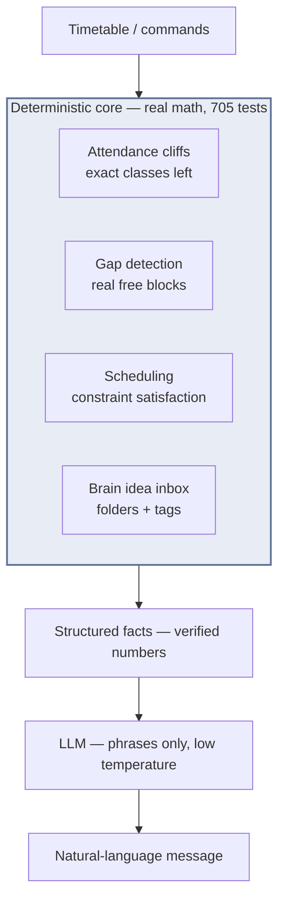

# 705 tests and a $0 bill: building Lumina without an LLM making decisions

The pitch for **[Lumina](https://github.com/KumarAnubhav64/Lumina)** sounds like another AI wrapper: *"a Telegram bot that watches your timetable and negotiates your free time."* But the design decision that made it work — and the one I'd defend in any review — is what the LLM is **not** allowed to do.

**The core rule: the LLM never makes a decision about a number. It only phrases the results of deterministic computation.**

## The temptation, and why I refused it

The easy version of this product is: send the bot your timetable, and let an LLM figure out attendance risk, gaps, and what to schedule. It's three hours of work and it's wrong in ways you can't see.

The failure mode isn't the *average* answer — it's the tail. A "75% attendance required, you're at 71%, and here's exactly which 3 classes you must not skip" message is only useful if it's **exactly** right. When an LLM computes that, it's usually right. When it's wrong, the student skips the wrong class and their attendance permanently breaks — and nobody can audit *why* the model said what it said.

So the architecture became:

```
timetable → deterministic core (real math: attendance %, gap detection, scheduling)
                ↓
         computed facts (structured, testable)
                ↓
         LLM (phrases the facts in natural, friendly language)
```

The LLM's temperature is set low, it's given the facts as structured data, and it's explicitly instructed: **do not invent numbers, do not judge, only phrase.** The numbers come from code with tests. 705 of them, at 86% coverage.



## What the deterministic core actually computes

- **Attendance cliffs:** the exact "classes left before 75%" arithmetic. The bot can tell you *today* that you have 3 free cuts left, not an estimate.
- **Gap detection:** free blocks in the timetable, real ones, with real start/end times.
- **Scheduling:** goals placed into free gaps by actual constraint satisfaction (a goal that needs 2 hours doesn't go into a 45-minute gap).
- **The Brain:** an ADHD-friendly idea inbox with Obsidian-style folders and tags, exported to a real `/vault` markdown structure.

Every one of those is a pure function with a test. "Given this timetable, the answer is 3" — not "probably around 3."

## 11 commands, one `/scan` pipeline

The surface is 11 umbrella commands (`/today`, `/goal`, `/timetable`, `/academic`, `/idea`…). The fun one is `/scan`: photograph your timetable, and a vision pipeline extracts the table into structured data — again feeding the deterministic core, not a fuzzy chat.


## The resilience work no one sees

A bot that misses a nudge because of a cold start or a rate limit is useless. Lumina has a **durable send-retry queue on serverless Redis**: every outbound message is enqueued before it's sent, and a worker retries until the user actually receives it. The reliability property is "no nudge is ever lost," and it's enforced by the queue, not by hope.

## Why this is the pattern, not the exception

Every LLM feature I've built since follows the same rule, including [Peekaboo](peekaboo-zero-dollar-face-recognition) — where the *entire* classification pipeline is deterministic models and there's no LLM in the loop at all.

The pattern in one sentence: **let the machine do the math, let the model do the talking.** The LLM is the presentation layer of a real computation engine. That inverts the usual "AI-first" instinct, and it's the difference between a demo and a tool people trust with their attendance record.

705 tests, 86% coverage, $0/month on Render's free tier. The bill was never the interesting number — the confidence was.
