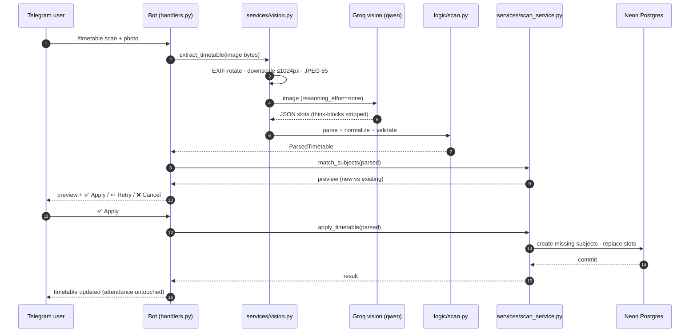

# Reading a timetable photo with a $0 vision budget

The most-tuned subsystem in [Lumina](https://github.com/KumarAnubhav64/Lumina) is the one that looks simplest from the outside: **user sends a photo of a printed timetable, bot replies with a preview and an Apply button.**

Underneath that one command is a pipeline that had to fight three enemies at once — real photo pathologies (blur, glare, rotation, cramped tables), Groq free-tier token limits, and a non-negotiable architectural rule. This post is the story of that pipeline: what broke, what we measured, and the exact knobs that make it work for $0.

## The pipeline in one diagram



Every step exists because of a specific failure we either hit or predicted. Let me go through the interesting ones.

## The token budget is the boss

Groq's free tier is generous with *requests* but strict with *tokens per request* — and here's the subtle part: **the token allowance is shared between the image and the answer**. A 12-megapixel phone photo of a timetable can starve the model's output budget before it writes a single JSON key.

**The fix: downscale ≤1024 px and re-encode to JPEG quality 85.** Huge photos get cut down dramatically in image tokens. The trade-off is real — small or blurry text can be lost in the downscale — so the prompt tells the model to guess the most reasonable value, and the user *must* review the preview before Apply. The pipeline is explicitly allowed to misread; the UI is designed around that.

## EXIF rotation: a fix, not a choice

Portrait photos of timetables are the norm, and `thumbnail()` doesn't transpose. A portrait photo would reach the model **sideways** — every 09:00 becomes a 17:00 in the worst case. The fix is one line with an outsize effect:

```python
img = ImageOps.exif_transpose(img)   # first
img.thumbnail((1024, 1024))          # then downscale
```

Verified by a test that builds an EXIF-tagged image and asserts the pipeline orients it correctly. This one is in the "silently catastrophic if wrong" category — a sideways timetable isn't a blurry timetable, it's a *confidently wrong* one.

## `reasoning_effort="none"` — thinking ate the budget

The vision model's default thinking mode would burn the **entire output budget emitting `<think>` blocks before any JSON**. Disabling reasoning yields direct structured output — about 3 seconds per scan instead of a timeout. The fallback ladder:

1. Models that reject the kwarg (`BadRequestError`/`TypeError`) → retry without it.
2. Think-block stripping still runs on the output either way.
3. The corrective retry still covers the output.

## `<think>`-block stripping: the pathology we actually saw live

The handler strips closed `<think>...</think>` blocks *and* the dangling unclosed opener — the exact pathology seen in production where thinking ate the whole budget and the block never closed. Cheap insurance against a model-version change. This is the kind of thing you only add after watching it happen once.

## One corrective retry, then fail

A non-JSON first answer (the common "the model wrapped prose around the JSON" case) gets **exactly one corrective retry** — "output only JSON" — then a friendly error. Why not more? Unlimited retries burn free-tier rate limits and spam the API; zero retries fail on the most common failure mode. One is the sweet spot, and it's a constant that's easy to reason about.

## The rule that makes it trustworthy: the model proposes, code decides

Here's the architectural heart. The vision output goes through a **strict pure parser** (`logic/scan.py`) that does the actual work of turning model output into data:

- **Day normalization** — full, 3-letter, and 2-letter spellings, case-insensitive: `monday`, `mon`, `mo` all resolve to `MONDAY`. The model can't invent a day that doesn't exist.
- **Time normalization** — including the beast: **bare 12-hour PM times without a meridian**. A scanned timetable says `12:00 – 1:30` and the model faithfully reports end `1:30` — which is before the start. The parser's heuristic: if `end <= start` and `start >= 12:00` and `end < 12:00`, assume PM. `1:30` becomes `13:30`, the slot is valid, and the model never had to know.
- **Lab-label stripping** — codes come back with the cell's lab label glued on (`CS-3101 Lab1`, `CS-3105 Labl`). A regex strips it with a *required separator* so a legitimate code like `CS3101LAB` is never mangled — subject identity stays stable across rescans of the same timetable.
- **Lab inference** — if the code itself says "lab", the slot is treated as a lab even when the model forgot the flag.
- **Dedupe + sort** — identical duplicate slots are dropped; slots sort by (weekday order, start, end); subjects sort by name. The output is deterministic given the same photo.
- **Structural rejection** — missing day, bad time, `end <= start`, no classes found, non-JSON: all raise with a *human-readable reason*, and the user sees a friendly error, never garbage data.

The parser is deliberately **conservative** — a weird-but-valid layout can be rejected rather than guessed. That's the cost of the rule, and it's the right cost. As the docs put it: *the model can misread; it can never write.*

## The confirm gate — nothing is written without Apply

The parsed result goes to the user as a preview: new subjects vs. existing, slots to replace, with ✅ Apply / ↩ Retry / ❌ Cancel inline buttons. The confirmation state lives **in process memory** (`bot/scan_flow.py`) — a Render restart silently expires a pending confirmation, which is safe (nothing is written without Apply) and much simpler than a DB-backed state machine. The cost: a user mid-flow during a deploy just re-runs the command. Trade-off accepted.

Only after Apply does `apply_timetable` write: create missing subjects, replace slots — and **attendance is untouched**. Rescanning your timetable after a schedule change must never nuke your attendance history.

## The calendar cousin: classification as a deliberate heuristic

The same pipeline serves `/academic calendar scan`, with one extra heuristic: **event-kind auto-classification** — titles classified HOLIDAY / EXAM / OTHER by keywords plus a "… Day" suffix rule ("Independence Day", "Sports Day" → holiday). It's wrong sometimes (a "Workshop Day" is classified a holiday). The trade-off is zero-input convenience vs. asking the user to tag every event — and a wrong HOLIDAY only *frees* time; it never fabricates obligations. Heuristics that fail safe are the ones worth shipping.

## What the whole thing taught me

1. **On a shared token budget, image size is the enemy.** Downscaling before the model is the single highest-leverage optimization in the entire pipeline — it's not a quality compromise, it's the thing that makes the budget work at all.
2. **Model output is a suggestion, not a fact.** Every interesting bug in this pipeline was the model being *plausibly wrong* — sideways photos, bare 12-hour times, glued labels. The parser isn't a formality; it's the actual product.
3. **The confirm gate is the trust mechanism.** "The model can misread; it can never write" is what makes a $0 vision pipeline safe enough to write to your real attendance data.

For how the bot keeps its other core promise — the right nudge at the right minute — through failures and cold starts, see [The right nudge at the right minute](lumina-durable-nudges). For the deterministic core underneath everything, [Building a deterministic core: the LLM never computes, never writes](lumina-deterministic-core).
