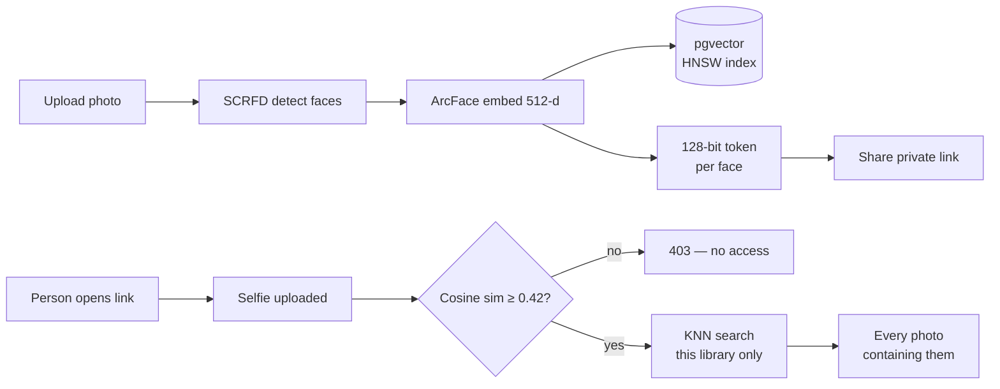
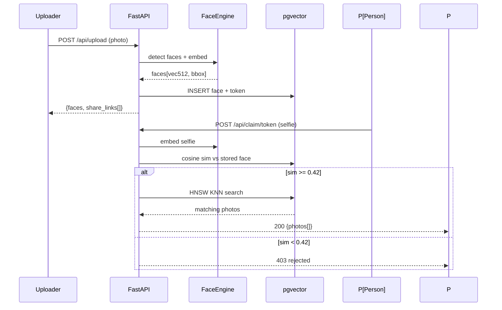
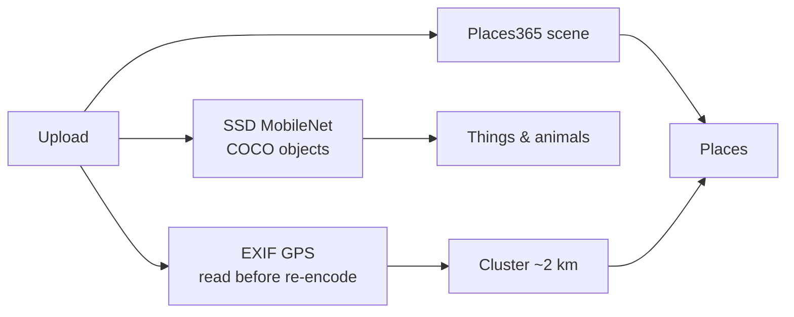

# How I built a face-recognition photo library for exactly $0

Every "find your photos by face" product I've seen either charges per scan or uploads your photos to someone else's model API. I wanted a Google-Photos-style library where **the face recognition runs on-device, the whole stack is free-tier, and the person in the photo gets to claim their own photos** — no account required.

That became **[Peekaboo](https://github.com/KumarAnubhav64/peekaboo)**: upload a photo, every person in it gets a private claim link, and after a selfie challenge each person sees every photo containing them — nothing else.

This post is the engineering story. All costs are real, all free tiers are the ones I'm actually on.

## The core loop

The product works in two phases that sound like one feature but are two completely different engineering problems.

**Phase 1 — upload:** detect every face, embed it into a 512-d vector, store it with a 128-bit random token per face.

**Phase 2 — claim:** a person opens their link, uploads a selfie, we embed it too, compare cosine similarity against the stored face, and if it passes we run a vector search across the whole library and show only *their* photos.

The interesting part is that **the claim token is the credential**. There's no account, no phone number, no email. The link *is* the key. That keeps the privacy story simple: the uploader never sees anyone else's photos, and the person in the photo never needs to sign up.



## Why it costs $0

The usual way to build this is to call a paid face-recognition API per photo. At a few cents per scan, a real camera roll (say 5,000 photos) costs real money, and your users' faces are traveling to a third party.

The free way: **open models, running on your own machine.**

- **Face detection:** InsightFace SCRFD — fast, accurate, MIT-licensed.
- **Face embedding:** InsightFace ArcFace — outputs a 512-d vector where the same person's faces are close together and different people are far apart.
- **Object tagging:** SSD MobileNet V1 (COCO, 80 classes) as ONNX — detects dogs, cars, receipts, surfboards.
- **Scene classification:** Places365 ResNet-18 as ONNX — recognizes "beach", "office", "mountain" when a photo has no GPS.

None of these are APIs. They're model files that download once and run locally — CPU is fine for photos (a few hundred ms each). No per-photo fee, no rate limits, no face data leaving your machine.

## The vector search is the database's job

Face embeddings are useless without a way to compare them fast. ArcFace vectors live in **Postgres + pgvector**, with an **HNSW (Hierarchical Navigable Small World)** index.

```sql
CREATE INDEX ON faces USING hnsw (vec vector_cosine_ops);
```

A claim selfie becomes one query: "find all faces within cosine distance X of this vector." At thousands of faces per library, that's milliseconds. Storing vectors *inside* Postgres (rather than in a separate vector database) means one database, one backup, one thing to learn.

The similarity threshold matters a lot. Too low and strangers can claim your photos; too high and the same person at different ages or angles gets locked out. I test the boundary continuously — there's a sample set in the repo that exercises both the "pass" and "reject" paths.



## Places and things, without GPS

Phone photos carry EXIF GPS — but only for the *original* file. The moment you re-encode for the web, the GPS is gone. So the pipeline reads GPS **before** any transformation, clusters coordinates into places (~2 km radius), and for photos without GPS, falls back to the Places365 scene label. The result: a "Places" view that groups a beach trip even when the location data was stripped.

Objects are simpler: SSD runs once per upload, tags get stored as JSON, and a "Things & animals" view is just a grouped query.



## Multi-tenancy that can't be bypassed

Each account owns its library, like Google Photos. The subtle part: **claim links are minted inside a tenant, and the verification search is scoped to that tenant** — even if the *same person's face* appears in two different accounts, a claim link from account A can never reveal photos from account B. Every query carries `tenant_id` scoping, not just the URL.

Auth is email/password (bcrypt) plus Google SSO, with sessions as JWT in an httpOnly cookie. No tokens in JavaScript, which keeps XSS from stealing sessions.

## The stack, priced

| Layer | Choice | Cost |
|---|---|---|
| API | FastAPI + Uvicorn | $0 |
| Face engine | InsightFace (SCRFD + ArcFace) | $0, MIT |
| Objects / scenes | SSD MobileNet + Places365 (ONNX) | $0 |
| Database | Neon Postgres + pgvector (HNSW) | $0 free tier |
| Storage | Neon S3 (S3-compatible) | $0 free tier |
| Hosting | HF Spaces + Vercel free tiers | $0 |

## Lessons worth stealing

1. **The expensive part of AI products is usually the inference API — replace it with open models.** If your task is standard (detection, classification, embeddings), a free open model will beat a paid API on cost and often on privacy story.
2. **Do the vector search in the database you already have.** pgvector made this a one-file feature. A separate vector DB was a risk, not a requirement.
3. **Read metadata before you destroy it.** Re-encoding strips EXIF; the pipeline reads GPS before any pixel is touched.
4. **The credential can be a link.** Claim tokens are stateless, unguessable (128 bits), and give exactly the access they were minted for. No auth system needed for the *person in the photo* — which is most of the user base.

The whole thing — including a one-command `docker compose up` self-host suite and a landing page — is [on GitHub](https://github.com/KumarAnubhav64/peekaboo). The cloud version costs $0/month. The self-hosted version costs $0/month. The models cost $0. The math was the fun part.
